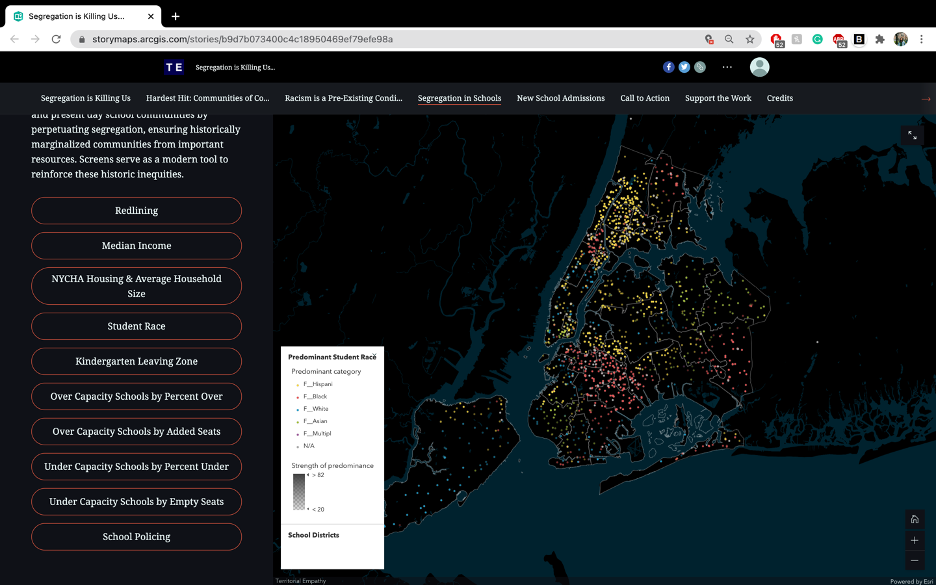

# Overview of the Geonarrative: [Segregation is Killing us](https://storymaps.arcgis.com/stories/b9d7b073400c4c18950469ef79efe98a)

## Introduction

The geo-narrative titled Segregation is Killing us exposed another huge public health crisis: Segregation. This project focuses on the comparison between segregation and COVID-19 impacts on the New York city population the state “Contrary to popular belief, COVID-19 is no great equalizer. In our analysis, we found segregation itself is a public health crisis NYC.”

This narrative focuses on __ topics, they first preface the effects of COVID-19 and its effects on the POC and minority communities, they then dive deeper in the hardest hit communities. The narrative then looks to the history of these communities in a “Racism is Pre-Existing Condition”, They then take the narrative to focus on schools and how segregation plays a role in schools and lastly a solution and what we can do to fix the education system in NYC. Lastly the Narrative urges the reader to go take action, provide feedback and list credits.

The audience for this project seems to be for anyone, to spread awareness but more specifically targeted for the policy makers and city planners of NYC. There is a very clear tone of urgency and how important it is for the city to take action immediately.

The authors of this project are two organizations that worked together to create this, the first is Territorial Empathy, they are a nonprofit design collective and are determined to solve topical pressing urban issues. This organization have been working together for 7 years and have focused on a lot of different issues, from the Arab Israeli conflict to Central Americas drought struggles to the climate change and migration in the United States. They are determined to spread awareness through factual based visualization. The second organization is IntegrateNYC. They are a youth-led organization that stands for equity and justice in schools withing NYC. They develop and work with youth leaders who “repair the harms of segregation and build authentic integration and equity.”

In relation to this project, both organizations focused on data that is relevant to within the past 5 years. All their demographic data was acquired from the United States Census Bureau and American Community Survey from 2014 – 2018.  Their Air Pollution Data from 2018 was found through the NCY Community Air Survey and their Hospitalization Data (2012 – 2014) was found through the New York State Statewide Planning and Research Cooperative Systems Discharge Data. All the School Demographics (2018-2019), Capacity and Enrollment Data (2019) was Acquired from the NYC Department of Education and NYC School Construction Authority. Lastly, School Policing data was sourced from the NY Policy from the year 2019.

## Geo-Narrative Mapping Functions and Visualizations

### 1.Segregation is Killing Us

Starting off with the first section, the geo-narrative does a great job setting up the story by visualizing what a hypothetical situation of if New Yorkers were infected with COVID-19 would look if they were 30 people. They show great statistics such as 8 people would be over 65, 13 would live in high poverty neighborhoods and at least 4 people would have died in phase 1. This was the first video hooks the reader in and immediately inflects emotion.

They also have another map that animates and depicts confirmed Percent Positive tests. This is the metric used to determine hotspot locations and reopening decisions. Data from NYC Department of Health and Human Services. The animations time scope is from April to June.

### 2. Hardest Hit Communities
In this section, there are a lot of different visualizations the first one simply graphs the infections and hospitalization and deaths by race. Here they found that when “compared to White New Yorkers, Black and Lantix New Yorkers are 1.5X more likely to be infected by COVID-19 and 2X more likely to die from the virus.”

The next visualization does a great job of COVID-19 Phase 1 Casualties by neighborhood. They have a great interactive map that conveys cases by race and income as well as deaths by race and deaths by income.

The third visualization is animation of the number of positive cases from March end to the beginning of June. This animation does a great job highlight the positive cases by income levels of high medium and low what they find is that lower income communities simply cannot afford to quarantine.

### 3. Racism is Pre-Existing  
In this section, the narrative create a map made using ESRI and ArcMap. They use the ACS survey information and make an interactive web map that maps different variables in NYC that the user can click on to visualize. These are Redlining, Median Income, Predominant Language, Predominant Race, Country of Origin, FPM Air Pollution and Asthma Hospitalization Rate.

The second infographic does a great job connecting segregation back in the 40’s to air quality today and how these are effecting todays community due to COVID-19.  

There are so many other helpful visualizations, and a great geonarrative to check out!

## Systemic Architecture

They systematic architecture of this geo narrative, uses the the Story Maps tool that ARCGIS has created. The data used was put into the interface itself and the mops were created through the add map feature within story maps.

Taking a look into the console, I found that some of the maps created were actually made using map box and then were embedded into the template that arcgis provides. Some of the GIS work done was simply done using the story maps layout tool, that has the feature to visualize and analyze the maps.

All of the maps are created using ESRI and have very similar functions to Leaflet webmapping tool. There is a zoom in and zoom out feature, as well as location feature that can give you real time information on where you are located. For this narrative, if you were located in NYC seeing this, it would be really cool to pinpoint your location and see how segregation and covid-19 is present where you are located. There is also another tool that can be used to turn the legend on and off as well as a home icon which can take you back to the default map settings.

## Design Critique

### Pros
1.	This map is super user friendly, and the heading, subheading, and more are all very cohesive and there is a clean theme to it.
2.	The navigation is clean, and the maps were super user friendly and easy to navigate.
3.	The navigation was also sticky which made it more user friendly and easy to move from sections
4.	The colors for each identified race stayed cohesive throughout the narrative, this made it super easy to understand maps, videos and others visualization and kept the user immersed without having to constantly look to the legend.

### Cons
1.	Though overall this map had such a clean design, take a look at this through accessibility some key information was colored at times, which means that a reader who may be color blind is not able to read information.
2.	The sidecar preface was a little hard to get used to as the map stayed put and the interactivity changed. Though this is more of a preference, but it didn’t feel natural and a little hard to get used.

## Overall Thoughts

### Cons
I think there is an importance striking a balance and something to keep in mind with geo narratives is information overload. The authors did a great job in showing a lot of data but it definitely could get overwhelming at times. There were too many variables at plat at times like this:

Another thing that I felt could have been done differently is that while they did a great job telling the story, the segregation in term of school seemed liked there were two parts to this project which the first was simply air quality and COVID, the other was educational. While I do believe is also important to discuss but they could have been two separate projects all together.

Lastly, it was interesting to bring up air quality and it would have been nice to preface with the history of segregation because in the beginning it came off as these disparities are present due to segregation in the present day which is not necessarily true.

###Pros
Overall, this was a beautiful and informative map. The visualizations and story inflicted emotion, something authors Stuart Aitken and James Craine encourage in the reading affective Geo visualization. This narrative gave so much information and connected so many different things and told a story from start to end.

The authors of the narrative did a great job being creative with animations and infographics as they told a story and design made them more interesting which motivated the reader to be more of an active viewer.
